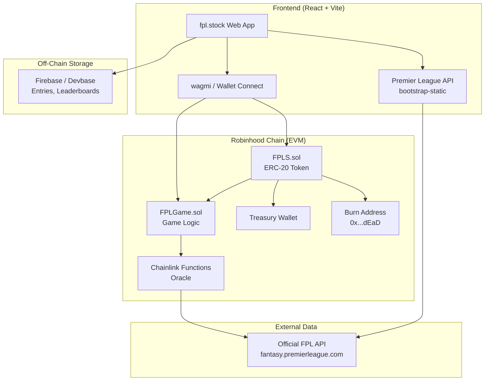
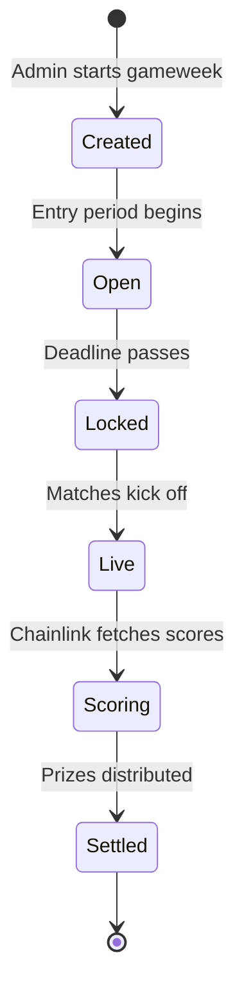
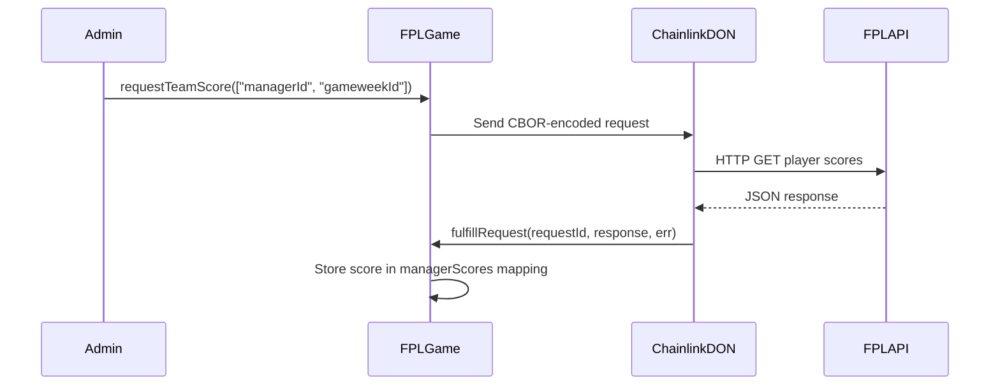

# fpl.stock — Whitepaper v1.0

**A Decentralised Fantasy Premier League Protocol with Deflationary Tokenomics & Real-World Asset Integration**

*Deployed on Robinhood Chain · Powered by Chainlink Functions · Synced with the Official Premier League API*

---

## Table of Contents

1. [Abstract](#abstract)
2. [Problem Statement](#problem-statement)
3. [Solution Overview](#solution-overview)
4. [System Architecture](#system-architecture)
5. [Token Economics ($FPLS)](#token-economics-fpls)
6. [Game Mechanics](#game-mechanics)
7. [Smart Contract Design](#smart-contract-design)
8. [Oracle Integration (Chainlink Functions)](#oracle-integration-chainlink-functions)
9. [Real-World Asset (RWA) Integration](#real-world-asset-rwa-integration)
10. [Revenue Model & Treasury](#revenue-model--treasury)
11. [Reward Distribution](#reward-distribution)
12. [Security Considerations](#security-considerations)
13. [Roadmap](#roadmap)
14. [Risk Factors](#risk-factors)
15. [Conclusion](#conclusion)

---

## Abstract

**fpl.stock** is a fully decentralised fantasy football protocol deployed on Robinhood Chain that merges competitive Premier League fantasy gaming with sustainable DeFi tokenomics and real-world asset (RWA) exposure. Players build squads of 11 Premier League footballers within a £70M budget, pay an entry fee in the protocol's native **$FPLS** token (which is **permanently burned**), and compete on weekly leaderboards powered by live match data delivered via Chainlink Functions. The protocol generates creator rewards from the $FPLS token launch on Robinhood Chain, distributing **90% to all active participants** and retaining **10% for the platform treasury**. Every entry fee transaction is a deflationary event, systematically reducing the circulating supply of $FPLS and creating long-term value appreciation for holders.

---

## Problem Statement

Traditional fantasy football platforms suffer from several structural issues:

| Problem | Description |
|---------|-------------|
| **Centralised Control** | Platforms like FPL, FanDuel, and DraftKings are fully centralised. Operators control prize distribution, fee structures, and can unilaterally change rules. |
| **Opaque Prize Pools** | Users have no visibility into how entry fees are allocated. Rake percentages are hidden and frequently exceed 15-20%. |
| **No Value Accrual** | Participation creates no lasting economic value for users. Entry fees are sunk costs with no secondary market or residual benefit. |
| **Inflationary Reward Tokens** | Many GameFi projects issue unlimited reward tokens, causing hyperinflation and value collapse. |
| **No Real-World Backing** | Crypto gaming tokens are purely speculative with no connection to tangible assets. |

---

## Solution Overview

fpl.stock addresses each of these problems through a novel protocol design:

```
┌─────────────────────────────────────────────────────────┐
│                    USER FLOW                            │
│                                                         │
│  1. Connect Wallet (Robinhood Chain)                    │
│  2. Build Squad (11 players, £70M budget)               │
│  3. Select Captain (2x points multiplier)               │
│  4. Pay Entry Fee (burned $FPLS tokens)                 │
│  5. Compete on Weekly Leaderboard                       │
│  6. Receive Creator Rewards (90% to all players)        │
│  7. Winner Takes Head-to-Head Prize Pool                │
└─────────────────────────────────────────────────────────┘
```

**Key Differentiators:**

- **100% Burn-on-Entry**: Every single $FPLS token paid as an entry fee is sent to a dead address (`0x...dEaD`), permanently removing it from circulation. There is no rake.
- **Dual Reward System**: Winners earn head-to-head prizes, but *all* participants receive creator rewards from the $FPLS token launch.
- **On-Chain Transparency**: All entries, burns, and distributions are verifiable on Robinhood Chain.
- **Oracle-Verified Scoring**: Chainlink Functions fetch official Premier League API data to calculate scores on-chain, eliminating manipulation.
- **RWA Integration**: A 3% transfer tax on $FPLS accumulates in the treasury, which is allocated toward purchasing real-world equities (e.g., GME, AAPL) through Robinhood Chain's RWA infrastructure.

---

## System Architecture



### Component Breakdown

| Component | Technology | Purpose |
|-----------|------------|---------|
| **Frontend** | React, Vite, TailwindCSS | Squad builder, leaderboards, real-time fixtures |
| **Wallet** | wagmi, MetaMask/Injected | User authentication and transaction signing |
| **Token Contract** | Solidity 0.8.24, OpenZeppelin | ERC-20 with 3% transfer tax and burn mechanics |
| **Game Contract** | Solidity 0.8.24, Chainlink Functions | Entry processing, score verification, prize distribution |
| **Oracle** | Chainlink Functions (DON) | Fetches live player scores from the Premier League API |
| **Data Layer** | Firebase (Devbase) | Stores entries, team compositions, historical results |
| **Chain** | Robinhood Chain (Chain ID: 46630) | EVM-compatible L1 with native RWA capabilities |

---

## Token Economics ($FPLS)

### Token Specification

| Parameter | Value |
|-----------|-------|
| **Name** | FPL.STOCKS |
| **Symbol** | $FPLS |
| **Standard** | ERC-20 |
| **Decimals** | 18 |
| **Initial Supply** | 100,000,000 (100M) |
| **Max Supply** | 100,000,000 (fixed, no minting in production) |
| **Transfer Tax** | 3% (sent to Treasury) |
| **Entry Fee** | Configurable (default: 1,000 FPLS per gameweek) |
| **Burn Mechanism** | 100% of entry fees sent to `0x...dEaD` |

### Deflationary Model

The core economic innovation of fpl.stock is its **dual deflationary pressure**:

#### 1. Entry Fee Burns (Primary Deflation)
Every time a user enters a gameweek, their entry fee in $FPLS is transferred directly to the burn address (`0x000000000000000000000000000000000000dEaD`). This is enforced at the smart contract level in `FPLGame.sol`:

```solidity
require(fplsToken.transferFrom(msg.sender, BURN_ADDRESS, entryFee), "Fee transfer failed");
```

This is not a soft burn or a lock — the tokens are **permanently irrecoverable**.

#### 2. Transfer Tax (Secondary Deflation via Treasury)
Every peer-to-peer transfer of $FPLS incurs a 3% tax, which is redirected to the protocol treasury. This tax applies to all transfers except those involving the owner, treasury, or burn address (which are excluded). The treasury funds are used for:
- Platform development and maintenance
- RWA stock purchases on Robinhood Chain
- Marketing and community incentives

### Supply Projection Model

Assuming 38 Premier League gameweeks per season and growing participation:

| Season | Avg Weekly Entries | Entry Fee (FPLS) | Annual Burn | Cumulative Burn | Remaining Supply |
|--------|-------------------|------------------|-------------|-----------------|------------------|
| Year 1 | 500 | 1,000 | 19,000,000 | 19,000,000 | 81,000,000 |
| Year 2 | 2,000 | 1,000 | 76,000,000 | 95,000,000 | 5,000,000 |
| Year 3+ | Dynamic | Adjusted | — | — | Scarce |

> [!IMPORTANT]
> As supply decreases, the entry fee will be progressively reduced by governance to maintain accessibility. The deflationary pressure ensures that even with lower nominal fees, the economic value burned per entry increases over time.

---

## Game Mechanics

### Squad Building

| Rule | Constraint |
|------|-----------|
| **Squad Size** | Exactly 11 players |
| **Budget** | £70,000,000 (£70M) |
| **Max Per Team** | 3 players from any single Premier League club |
| **Formations** | 4-4-2, 4-3-3, 3-5-2, 3-4-3, 5-3-2, 5-4-1 |
| **Captain** | 1 designated captain receives 2x points |
| **Data Source** | Official Premier League Fantasy API (`bootstrap-static`) |

### Scoring System

Points are calculated based on real Premier League match performance data, fetched from the official FPL API:

| Action | Points |
|--------|--------|
| Minutes Played (≥60 min) | 2 |
| Minutes Played (<60 min) | 1 |
| Goal Scored (FWD) | 4 |
| Goal Scored (MID) | 5 |
| Goal Scored (DEF/GK) | 6 |
| Assist | 3 |
| Clean Sheet (DEF/GK) | 4 |
| Clean Sheet (MID) | 1 |
| Penalty Save | 5 |
| Penalty Miss | -2 |
| Yellow Card | -1 |
| Red Card | -3 |
| Own Goal | -2 |
| **Captain Multiplier** | **2x all points** |

### Gameweek Lifecycle



1. **Created** — Admin calls `startGameweek(id)` on `FPLGame.sol`, opening a new gameweek.
2. **Open** — Users build squads and submit entries. $FPLS entry fee is burned on-chain.
3. **Locked** — After the Premier League deadline, no more entries are accepted.
4. **Live** — Matches are played. The frontend displays live scores from the FPL API.
5. **Scoring** — Chainlink Functions oracle fetches final player scores and writes them on-chain.
6. **Settled** — `distributePrizes()` is called. The top performer receives 95% of the prize pool. Creator rewards are distributed to all participants.

---

## Smart Contract Design

### FPLS.sol — The Token

```
Contract: FPLS (FPL.STOCKS)
Inherits: ERC20 (OpenZeppelin), Ownable
```

**Key Functions:**

| Function | Description |
|----------|-------------|
| `transfer()` | Overridden to apply 3% tax via `_transferWithTax()` |
| `transferFrom()` | Overridden to apply 3% tax via `_transferWithTax()` |
| `_transferWithTax()` | Core logic: calculates 3% tax, sends to treasury, transfers remainder |
| `setTreasury()` | Owner-only: updates treasury address |
| `setExcludedFromTax()` | Owner-only: excludes addresses from tax (e.g., DEX pools) |

**Tax-Exempt Addresses:**
- Contract deployer (owner)
- Treasury wallet
- Burn address (`0x...dEaD`)
- FPLGame contract (so entry fees burn the full amount, not 97%)

### FPLGame.sol — The Game Engine

```
Contract: FPLGame
Inherits: Ownable, ReentrancyGuard, FunctionsClient (Chainlink)
```

**Key Functions:**

| Function | Description |
|----------|-------------|
| `startGameweek(id)` | Owner-only: opens a new gameweek for entries |
| `enterGameweek(playerIds[])` | User submits 11 player IDs. Burns $FPLS entry fee. |
| `requestTeamScore(args[])` | Triggers Chainlink Functions to fetch a manager's score |
| `fulfillRequest()` | Chainlink callback: writes verified score on-chain |
| `distributePrizes(id, winners, amounts)` | Owner-only: distributes prizes after gameweek ends |
| `setEntryFee(fee)` | Owner-only: adjusts the entry fee denomination |
| `getParticipants(id)` | View: returns all participants for a gameweek |
| `getScore(id, manager)` | View: returns oracle-verified score for a manager |

**Security Features:**
- `ReentrancyGuard` on `enterGameweek()` prevents re-entrancy attacks
- `require(playerIds.length == 11)` enforces squad size at contract level
- `require(!gw.hasEntered[msg.sender])` prevents duplicate entries
- `require(gw.isActive)` ensures entries only during active gameweeks

---

## Oracle Integration (Chainlink Functions)

fpl.stock uses **Chainlink Functions** to bridge off-chain Premier League data to on-chain smart contracts. This is critical for trustless score verification.

### How It Works



### Oracle Source (JavaScript)

The Chainlink Functions DON executes a JavaScript snippet that:
1. Fetches the gameweek's live scoring data from `https://fantasy.premierleague.com/api/`
2. Calculates the total points for the manager's 11-player squad
3. Applies the captain multiplier (2x)
4. Returns the final score as a `uint256`

### Why Chainlink Functions?

| Requirement | Solution |
|-------------|----------|
| **Trustlessness** | Decentralised Oracle Network (DON) — no single point of failure |
| **Verifiability** | All scores are stored on-chain and publicly auditable |
| **Flexibility** | Arbitrary JavaScript execution for complex scoring logic |
| **Reliability** | Chainlink's battle-tested infrastructure with SLAs |

---

## Real-World Asset (RWA) Integration

fpl.stock leverages Robinhood Chain's native RWA infrastructure to provide tangible, real-world value backing for the protocol.

### The RWA Loop

```
$FPLS Transfer → 3% Tax → Treasury → Purchase RWA Stocks → Value Backing
```

1. **Tax Collection**: Every $FPLS transfer (buy, sell, P2P) incurs a 3% tax, directed to the treasury.
2. **RWA Purchases**: Treasury funds are periodically used to purchase tokenised real-world equities (e.g., GME, AAPL, TSLA) available on Robinhood Chain.
3. **Value Backing**: These RWA holdings provide a tangible asset floor for the $FPLS token, distinguishing it from purely speculative tokens.
4. **Transparency**: All treasury holdings and RWA purchases are visible on-chain.

### Why Robinhood Chain?

Robinhood Chain is purpose-built for tokenising real-world assets. It provides:
- Native RWA primitives for tokenised equities
- EVM compatibility for seamless smart contract deployment
- Regulatory-aware infrastructure
- Low transaction costs suitable for high-frequency gaming transactions

---

## Revenue Model & Treasury

### Revenue Streams

| Source | Mechanism | Destination |
|--------|-----------|-------------|
| **Transfer Tax** | 3% on every $FPLS transfer | Treasury wallet |
| **Creator Rewards** | Token launch rewards from Robinhood Chain | 90% players / 10% treasury |

### Treasury Allocation

| Allocation | Percentage | Purpose |
|------------|-----------|---------|
| **Platform Development** | 40% | Frontend, smart contract upgrades, audits |
| **RWA Stock Purchases** | 30% | Buying tokenised equities for value backing |
| **Marketing & Growth** | 20% | User acquisition, partnerships, community |
| **Operational Reserve** | 10% | Infrastructure, Chainlink subscriptions, gas |

> [!NOTE]
> The entry fee is **not** a revenue source for the platform. It is burned in its entirety. The platform sustains itself exclusively through the transfer tax and creator rewards, ensuring that users never pay a hidden rake.

---

## Reward Distribution

### Dual Reward System

fpl.stock operates a unique dual reward system that incentivises both competition and participation:

#### 1. Head-to-Head Prize Pool (Competitive)
- Each gameweek entry contributes to the prize pool (tracked off-chain via Firebase for display purposes)
- **95% of the prize pool** goes to the top performer
- **5% allocated** to platform operations
- Winner-takes-all format creates maximum competitive intensity

#### 2. Creator Rewards (Participatory)
- Sourced from the $FPLS token launch on Robinhood Chain
- **90% distributed to ALL active players** who entered that gameweek
- **10% allocated to the platform treasury**
- This ensures that even losing players receive tangible rewards for participation
- Creates a positive-sum game where every entry has value

### Distribution Schedule

```
Every Gameweek Settlement:
├── Prize Pool (from entry tracking)
│   ├── 95% → Winner (highest score)
│   └── 5%  → Platform Operations
│
└── Creator Rewards (from token launch)
    ├── 90% → All Participants (equal split)
    └── 10% → Treasury
```

---

## Security Considerations

### Smart Contract Security

| Measure | Implementation |
|---------|---------------|
| **Re-entrancy Protection** | OpenZeppelin `ReentrancyGuard` on all state-changing functions |
| **Access Control** | `Ownable` pattern for admin functions (`startGameweek`, `distributePrizes`) |
| **Input Validation** | Strict `require` checks on squad size (11), duplicate entries, active gameweeks |
| **Burn Verification** | Entry fees sent to verified dead address (`0x...dEaD`), not a contract-controlled address |
| **Oracle Security** | Chainlink Functions DON provides decentralised, tamper-proof data delivery |

### Frontend Security

| Measure | Implementation |
|---------|---------------|
| **Wallet Isolation** | Private keys never touch the frontend; all signing via injected wallet (MetaMask) |
| **API Proxy** | Premier League API calls proxied through Vercel serverless functions to prevent CORS and rate-limiting issues |
| **Environment Variables** | Admin private keys stored exclusively in Vercel environment variables, never committed to Git |

### Planned Audits

- [ ] Smart contract audit by a reputable firm (pre-mainnet)
- [ ] Chainlink Functions source code review
- [ ] Penetration testing on frontend and API proxy

---

## Roadmap

### Phase 1: Foundation (Current)
- [x] Deploy $FPLS token contract on Robinhood Chain testnet
- [x] Deploy FPLGame contract with Chainlink Functions integration
- [x] Build React frontend with real-time Premier League data
- [x] Implement squad builder with formation options and auto-complete
- [x] Integrate wallet connection (wagmi + MetaMask)
- [x] Deploy to Vercel with CI/CD pipeline

### Phase 2: Mainnet Launch
- [ ] Deploy contracts to Robinhood Chain mainnet
- [ ] Complete smart contract security audit
- [ ] Launch $FPLS token on Robinhood Chain DEX
- [ ] Configure Chainlink Functions on mainnet DON
- [ ] Implement live oracle scoring for GW1
- [ ] Launch marketing campaign and community building

### Phase 3: Growth
- [ ] Head-to-head matchmaking leagues
- [ ] Private leagues with custom entry fees
- [ ] Mobile-responsive PWA
- [ ] Social features (squad sharing, squad comparison)
- [ ] RWA dashboard showing treasury stock holdings
- [ ] Multi-gameweek tournaments

### Phase 4: Decentralisation
- [ ] Transfer admin functions to a multi-sig wallet
- [ ] Implement on-chain governance for entry fee adjustments
- [ ] Community voting on treasury RWA allocation
- [ ] Open-source all smart contracts and frontend code
- [ ] DAO formation for protocol governance

---

## Risk Factors

> [!WARNING]
> This section outlines key risks that users and investors should carefully consider.

| Risk | Severity | Mitigation |
|------|----------|------------|
| **Smart Contract Bugs** | High | Planned audit, extensive testing, `ReentrancyGuard` |
| **Oracle Manipulation** | Medium | Chainlink's decentralised DON, multiple data sources |
| **Premier League API Changes** | Medium | Version pinning, fallback data sources, manual override |
| **Regulatory Risk** | Medium | Robinhood Chain's regulatory-aware infrastructure |
| **Low Participation** | Medium | Creator rewards incentivise early adoption |
| **Token Price Volatility** | Medium | RWA backing provides value floor |
| **Rapid Supply Deflation** | Low | Dynamic entry fee adjustment mechanism |

---

## Conclusion

fpl.stock represents a novel fusion of competitive fantasy sports, sustainable DeFi tokenomics, and real-world asset backing. By burning 100% of entry fees, the protocol creates genuine scarcity without extracting value from users. By distributing creator rewards to all participants, it ensures that the game is positive-sum — not zero-sum. By integrating Chainlink Functions for trustless scoring and leveraging Robinhood Chain's RWA infrastructure, it bridges the gap between on-chain gaming and real-world financial value.

The result is a protocol that rewards skill, incentivises participation, and creates lasting economic value — all synchronised with the rhythm of the English Premier League.

---

**Contract Addresses (Testnet)**

| Contract | Address |
|----------|---------|
| $FPLS Token | `0xCf7Ed3AccA5a467e9e704C703E8D87F634fB0Fc9` |
| FPLGame | `0x5FC8d32690cc91D4c39d9d3abcBD16989F875707` |
| Treasury | `0xf39Fd6e51aad88F6F4ce6aB8827279cffFb92266` |

**Chain**: Robinhood Chain Testnet (Chain ID: 46630)  
**RPC**: `https://rpc.testnet.chain.robinhood.com`

---

*fpl.stock is an experimental protocol. This whitepaper is for informational purposes only and does not constitute financial advice. Participation involves risk of loss.*
